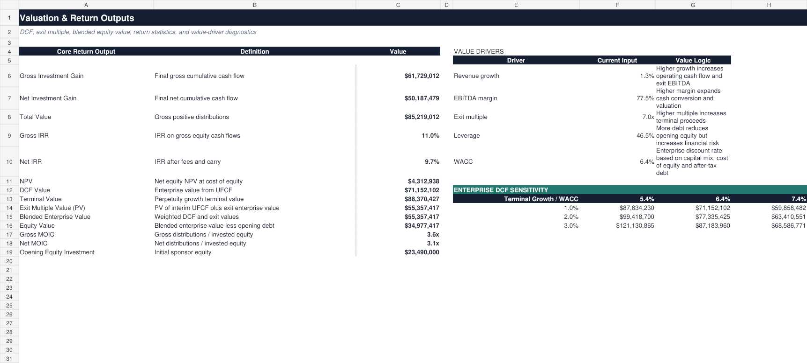

# Methodology and Model Governance

## 1. Analytical objective and scope

The model assesses the prospective risk-adjusted return and valuation of an illustrative equity investment in an approximately 10% remaining interest in the operational Darlington Point Solar Farm. The analysis is anchored to a July 2022 acquisition case and uses a 20-year annual forecast horizon in Australian dollars.

This is a public-information case study. It is designed to show a transparent investment-analysis process rather than replicate a sponsor's full underwriting model or an independently verified asset valuation.

## 2. Source hierarchy and assumption governance

Public transaction, asset, fund and market information is recorded in the **Sources** tab with:

- the value or assumption used;
- units and as-of date;
- source name and URL;
- the relevant model cell reference;
- rationale, estimation method and limitations; and
- the date the item was updated.

Where public disclosures are incomplete, assumptions are explicitly labelled and kept in blue-font input cells. Derived values and links are separated from user-controlled inputs. No external workbook links or macros are used.

## 3. Ownership and acquisition bridge

Disclosed asset-level transaction values are proportionally scaled to the assumed remaining interest. The model uses an illustrative A$43.87m enterprise value, funded with A$23.49m of opening equity and A$20.38m of debt. The acquisition bridge therefore reconciles the opening capital structure before transaction costs or financing-fee adjustments.

The approximately 10% ownership assumption is a conservative proxy based on public reporting and is not presented as a verified legal ownership percentage.

## 4. Operating cash-flow build

The annual operating model forecasts:

1. revenue from a stated Year 1 base and nominal growth assumption;
2. EBITDA using an explicit margin assumption;
3. EBIT after depreciation and amortisation;
4. cash tax based on EBIT and the selected tax rate;
5. capital expenditure as a percentage of revenue;
6. change in net working capital; and
7. unlevered free cash flow.

The current base case uses A$4.891m of starting revenue, 1.25% annual revenue growth, a 77.5% EBITDA margin, capex equal to 2.5% of revenue and net working capital equal to 1.0% of revenue. Depreciation and cash tax are set to zero as simplifying assumptions and are clearly disclosed.

## 5. Financing, fees and equity cash flow

The financing schedule begins with 46.5% debt funding, applies a 4.5% cash interest rate and amortises 4.0% of initial debt annually. Beginning debt, mandatory paydown, ending debt and cash interest are shown separately, with a visible roll-forward check.

Gross equity cash flow reflects asset cash flow after debt service and exit proceeds. Net equity cash flow then deducts:

- an annual management-fee proxy of 0.95% of opening equity; and
- a terminal performance-fee approximation equal to 20% of modeled outperformance above a 7.0% annual net IRR hurdle.

The fee treatment is deliberately transparent but simplified. It is not a full legal waterfall or a period-by-period NAV fee calculation.

## 6. Valuation and return methodology

The model presents both asset value and equity returns:

- **DCF:** unlevered free cash flow is discounted at a model-derived WACC. Terminal value uses the Gordon-growth method and is discounted using the same annual convention.
- **Exit multiple:** interim unlevered cash flows and the terminal enterprise value are discounted to present value. The terminal enterprise value is based on the selected exit EBITDA multiple.
- **Blended value:** DCF and exit-multiple values are combined through explicit input weights. The current base case uses the exit-multiple method for the selected enterprise value and retains the DCF as a valuation cross-check.
- **Equity bridge:** opening debt is deducted from enterprise value to derive implied equity value.
- **Returns:** gross and net IRR, gross and net MOIC, investment gain and equity NPV are calculated from the relevant equity cash-flow series.

The base-case WACC is 6.37%, derived from the disclosed proportional capital structure, an 8.0% cost of equity, a 4.5% pre-tax cost of debt and a zero tax-shield assumption. The valuation tab includes a live WACC/terminal-growth sensitivity table.

## 7. Scenario and risk methodology

Downside, base and upside cases change three material value drivers: revenue growth, EBITDA margin and exit multiple. The current probability weights are 25%, 55% and 20%, respectively.

The scenario module calculates:

- gross IRR and equity NPV by case;
- probability-weighted expected return and expected NPV;
- standard deviation of scenario returns;
- probability of a negative NPV;
- a discrete-case 95% VaR proxy;
- Sharpe and information ratios; and
- downside-to-upside IRR dispersion.

The VaR output is intentionally labelled as a three-case loss proxy. It is not a distributional, historical-simulation or Monte Carlo VaR.

## 8. Model controls

The **Checks** tab tests the principal integrity conditions, including:

- scenario probabilities and valuation weights summing to 100%;
- hold period and revenue commencement falling within the modeled horizon;
- WACC exceeding terminal growth;
- the debt roll-forward balancing;
- core valuation outputs being populated;
- non-negative exit multiples and DCF value;
- the opening equity bridge matching the disclosed transaction values;
- base-case return consistency across the model; and
- capital-structure weights summing to 100%.

The Investment Summary reports the aggregate model status. All checks pass in the uploaded base case.

## 9. Key limitations

Material items outside the present scope include detailed power-price and PPA modelling, merchant capture-price analysis, generation variability, degradation, availability and curtailment, detailed tax depreciation, refinancing, covenant and DSCR analysis, reserve accounts, decommissioning costs, legal fee waterfalls, portfolio diversification and independent technical or financial due diligence.

These omissions should be considered before interpreting the apparent precision of the outputs.

## 10. Recommended extensions for an infrastructure portfolio-management use case

| Priority | Extension | Portfolio-management value |
| --- | --- | --- |
| High | Actual-versus-budget operating history | Separates generation, price, availability, cost and timing variances and supports quarterly asset monitoring |
| High | Periodic NAV and valuation bridge | Explains value movement through cash flow, discount rates, market multiples, capital structure and distributions |
| High | Detailed debt and covenant schedule | Adds DSCR, interest coverage, refinancing risk, covenant headroom and liquidity visibility |
| Medium | Operating KPI module | Tracks generation, availability, degradation, curtailment, PPA exposure and merchant price capture |
| Medium | Multiple investment cases and portfolio aggregation | Adds concentration, diversification, liquidity and portfolio-level return analysis |
| Medium | Full fee and distribution waterfall | Replaces the simplified management-fee and terminal-carry approximations with legal-term mechanics |
| Medium | Monte Carlo or probabilistic driver analysis | Replaces the discrete-case VaR proxy with a fuller distribution of valuation and return outcomes |
| Medium | Quarterly dashboard and commentary | Converts model outputs into repeatable portfolio reporting, exception flags and decision-focused commentary |

These extensions would move the model from a single-asset recruitment case study toward a more complete infrastructure asset-monitoring and portfolio-management framework.
