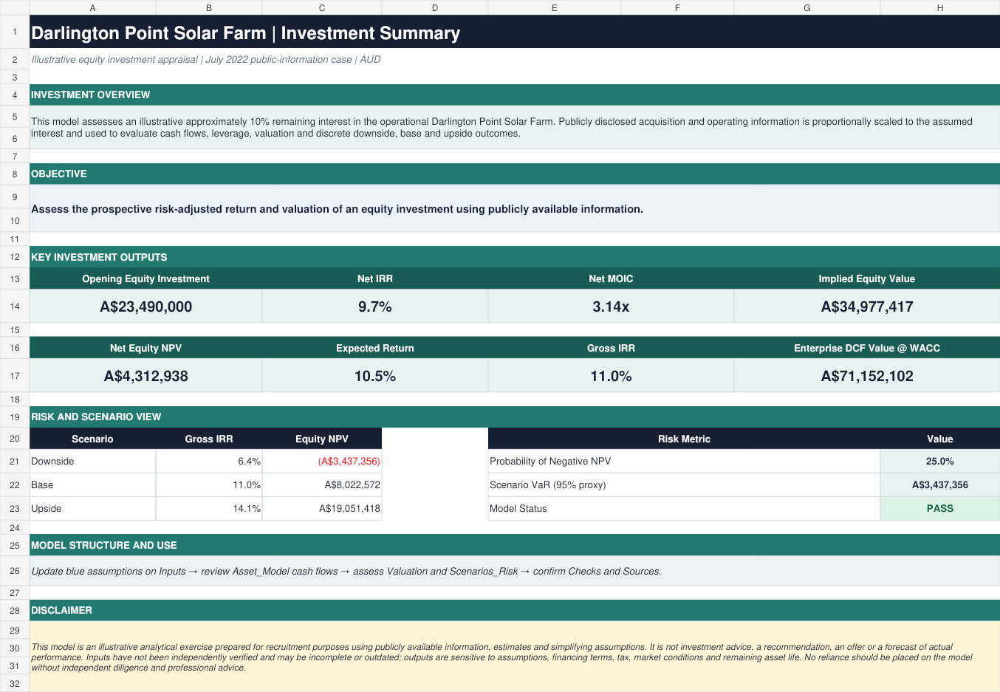

# Darlington Point Solar Farm | Infrastructure Investment Model

An illustrative, independently developed infrastructure investment model assessing an approximately 10% remaining interest in the operational Darlington Point Solar Farm. The model uses publicly available information and transparent simplifying assumptions to evaluate operating cash flows, leverage, valuation, scenarios and risk-adjusted equity returns.

[Download the Excel model](Darlington-Point-Infrastructure-Investment-Model-AHAC.xlsx) · [Review the methodology](METHODOLOGY.md)

## Investment snapshot

| Base-case output | Model result |
| --- | ---: |
| Opening equity investment | A$23.49m |
| Net IRR | 9.7% |
| Net MOIC | 3.14x |
| Net equity NPV | A$4.31m |
| Implied equity value | A$34.98m |
| Enterprise DCF value at WACC | A$71.15m |

These outputs are illustrative model results, not forecasts or investment recommendations.

## Purpose

This project demonstrates capability relevant to infrastructure investment and portfolio management, including:

- translating public asset and transaction information into auditable assumptions;
- constructing long-dated operating, financing and equity cash flows;
- monitoring leverage, debt amortisation, fees and value creation over time;
- applying DCF and exit-multiple valuation approaches with an equity bridge;
- testing downside, base and upside cases and probability-weighted risk outcomes; and
- maintaining model governance through explicit assumptions, sources and validation checks.

## What the model does

- Builds a 20-year asset-level operating and financing model.
- Separates unlevered asset cash flow from gross and net equity cash flow.
- Models debt draw, amortisation, cash interest, management fees and performance carry.
- Calculates IRR, MOIC, NPV, enterprise value and implied equity value.
- Includes DCF sensitivity to WACC and terminal growth.
- Assesses scenario-weighted expected return, probability of loss and a discrete-case VaR proxy.
- Provides a visible control framework and public-source assumption log.

## Suggested review path

1. **Investment Summary** — objective, headline returns, scenario outcomes and model status.
2. **Inputs** and **Sources** — assumption basis, units, public references and limitations.
3. **Asset_Model** — operating cash flow, debt schedule, exit proceeds and equity returns.
4. **Valuation** — DCF, exit-multiple valuation, equity bridge and sensitivities.
5. **Scenarios_Risk** and **Checks** — downside analysis, risk statistics and integrity tests.

## Workbook structure

| Tab | Purpose |
| --- | --- |
| Investment Summary | Recruiter-friendly overview of the investment case and key outputs |
| Inputs | Editable transaction, operating, financing, valuation and risk assumptions |
| Asset_Model | Annual operating cash flow, debt roll-forward, fees and equity cash flows |
| Valuation | Return metrics, DCF, exit-multiple value, equity bridge and sensitivity analysis |
| Scenarios_Risk | Downside, base and upside cases with probability-weighted risk diagnostics |
| Checks | Validation of assumptions, capital structure, debt and core outputs |
| Sources | Public references, assumption rationale, model references and update dates |

## Presentation and controls

Blue font denotes editable assumptions, green font denotes same-workbook links and black font denotes formulas. Current integrity checks return **PASS**. The workbook contains no macros and is intended to be opened in Microsoft Excel for full formula inspection.

## Disclaimer

This model is an illustrative analytical exercise prepared for recruitment and portfolio demonstration. It is not investment advice, an offer, a recommendation or a forecast of actual performance. Inputs have not been independently verified and may be incomplete or outdated. Outputs are sensitive to operating, financing, tax, market and remaining-asset-life assumptions. See [Methodology and Model Governance](METHODOLOGY.md) for the detailed assumptions, limitations and potential extensions.
